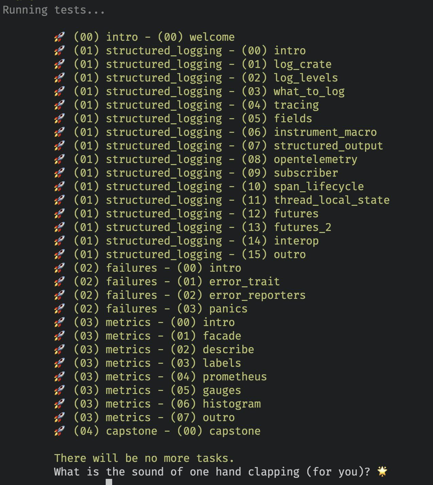

# Telemetry for Rust APIs

> You can't fix what you can't see



Your Rust application has finally been deployed to production! Nice! But is it working?  
This workshop will introduce you to a comprehensive toolkit to detect, troubleshoot and resolve issues in your Rust APIs.

You will be working through a series of test-driven exercises to learn Rust while building up your Rust observability toolkit!

This workshop is designed for people who have basic familiarity with Rust as a language and want to learn more about
Rust's observability story.  
If you run into any issue with the assumed level of Rust knowledge, please ping us and we'll sort it together!

> [!NOTE]
> This workshop has been written by [Mainmatter](https://mainmatter.com/rust-consulting/).  
> It's one of the trainings in [our portfolio of Rust workshops](https://mainmatter.com/services/workshops/rust/).  
> Check out our [landing page](https://mainmatter.com/rust-consulting/) if you're looking for Rust consulting or training!

## Getting started

Run

```bash
# Install necessary tools
cargo install mdbook
cargo install --git https://github.com/mainmatter/100-exercises-to-learn-rust mdbook-exercise-linker

# Clone the repository
git clone git@github.com:mainmatter/rust-telemetry-workshop.git
cd rust-telemetry-workshop

# Serve the book locally
cd book && mdbook serve --port 3012 --open
```

to open the companion book in your browser.

## Requirements

- **Rust** (follow instructions [here](https://www.rust-lang.org/tools/install)).  
  If Rust is already installed on your system, make sure you are running on the latest compiler version (`cargo --version`).  
  If not, update using `rustup update` (or another appropriate command depending on how you installed Rust on your system).
- _(Optional)_ An IDE with Rust autocompletion support.
  We recommend one of the following:
  - [RustRover](https://www.jetbrains.com/rust/);
  - [Visual Studio Code](https://code.visualstudio.com) with the [`rust-analyzer`](https://marketplace.visualstudio.com/items?itemName=matklad.rust-analyzer) extension.

## Solutions

You can find the solutions to the exercises in the [`solutions` branch](https://github.com/mainmatter/rust-telemetry-workshop/tree/solutions) of this repository.

## References

Throughout the workshop, the following resources might turn out to be useful:

* [Rust Book](https://doc.rust-lang.org/book/)
* [Rust documentation](https://doc.rust-lang.org/std/) (you can also open the documentation offline with `rustup doc`!)
* [`tracing`'s documentation](https://docs.rs/tracing)
* [`metrics`' documentation](https://docs.rs/metrics)

# License

Copyright © 2023- Mainmatter GmbH (https://mainmatter.com), released under the 
[Creative Commons Attribution-NonCommercial 4.0 International license](https://creativecommons.org/licenses/by-nc/4.0/).
